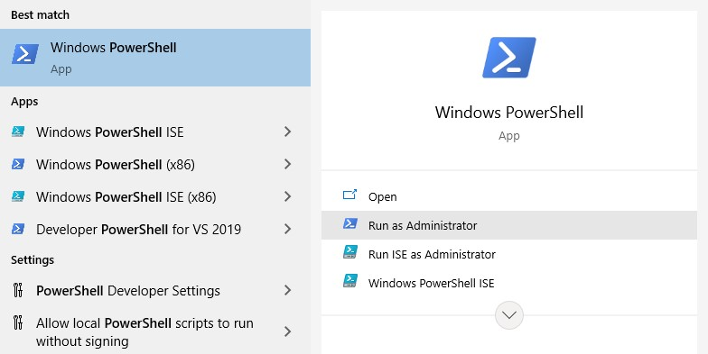

# SVPy | Spatial Vision Poka-yoke <a id="top"></a>

- [DepthAI Setup](#depthai-setup)
    - [Links](#depthai-setup-links)
    - [Windows](#depthai-setup-windows)
    - [Raspberry](#depthai-setup-ubuntu)

## DepthAI Setup

### Links <a id="depthai-setup-links"></a>

- [GitHub Repository](https://github.com/luxonis/depthai-python)

- [Documentation](https://docs.luxonis.com/en/latest/)

- [Welcome to Gen2 API](https://docs.luxonis.com/projects/api/en/latest/)

- [Installation](https://docs.luxonis.com/projects/api/en/latest/install/)

- [Supported Platforms](https://docs.luxonis.com/projects/api/en/latest/install/#supported-platforms)

[⇧](#top)

### Windows <a id="depthai-setup-windows"></a>

- Windows 10 Pro

- [Install the necessary dependencies](https://docs.luxonis.com/projects/api/en/latest/install/#windows)

1. Run Windows PowerShell as administrator

    

2. Install Chocolatey
    ```
    Set-ExecutionPolicy Bypass -Scope Process -Force; [System.Net.ServicePointManager]::SecurityProtocol = [System.Net.ServicePointManager]::SecurityProtocol -bor 3072; iex ((New-Object System.Net.WebClient).DownloadString('https://chocolatey.org/install.ps1'))
    ```

3. Close the PowerShell and then re-open another PowerShell as administrator.
    ```
    WARNING: It's very likely you will need to close and reopen your shell before you can use choco.

    You may need to shut down and restart powershell and/or consoles first prior to using choco.
    ```

4. Install Python and PyCharm
    ```
    choco install cmake git python pycharm-community -y
    ```

5. Install the DepthAI library
    ```
    python -m pip install depthai
    ```

6. Clone the repository
    ```
    cd C:\...\SVPy\OAK-D

    git clone https://github.com/luxonis/depthai-python.git

    cd depthai-python
    ```

7. Install the requirements
    ```
    cd examples

    python install_requirements.py
    ```

8. Test the installation
    ```
    Connect the OAK-D device to a USB 3 port.

    python 01_rgb_preview.py
    ```

[⇧](#top)

### Ubuntu <a id="depthai-setup-ubuntu"></a>

- Ubuntu Server 20.04.2 LTS 64-bit

- [Install the necessary dependencies](https://docs.luxonis.com/projects/api/en/latest/install/#ubuntu)

1. Install Python (3.6, 3.7, 3.8)
    ```
    sudo apt-get install python3
    ```

2. Clone repository
    ```
    git clone https://github.com/SergioVelmay/SVPy_SpatialVisionPoka-yoke.git
    ```

3. Change folder
    ```
    cd SVPy_SpatialVisionPoka-yoke/
    ```

4. Create virtual environment
    ```
    python3 -m venv venv
    ```

5. Active environment
    ```
    source venv/bin/activate
    ```

6. Install dependences
    ```
    pip install opencv-python

    sudo apt-get install libatlas-base-dev

    pip install depthai

    pip install pillow

    pip install openvino
    ```

8. Change folder
    ```
    cd SVPy/
    ```

9. Run the project
    ```
    python3 svpy.py
    ```

[⇧](#top)